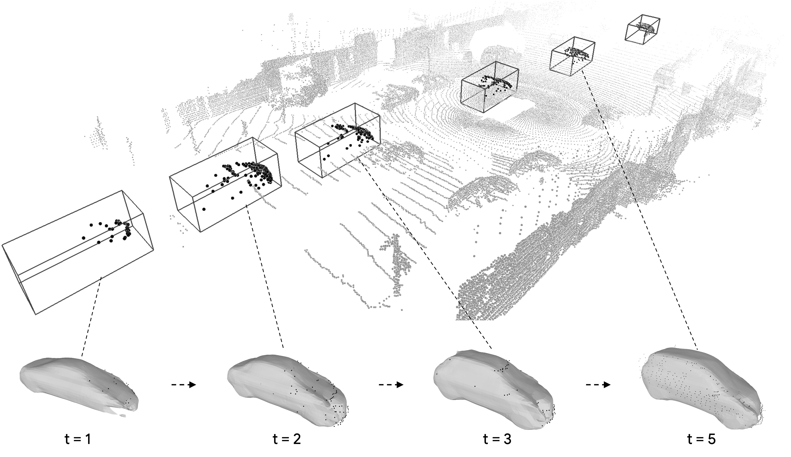

# Implicit Tracking

This repository is the official implementation of the paper:

> Online Adaptation for Implicit Object Tracking and Shape Reconstruction in the Wild  
> [_Jianglong Ye_](https://jianglongye.com/), [_Yuntao Chen_](https://scholar.google.com/citations?user=iLOoUqIAAAAJ), [_Naiyan Wang_](https://winsty.net/), [_Xiaolong Wang_](https://xiaolonw.github.io/)  
> RA-L 2022, IROS 2022

[Project Page](https://jianglongye.com/implicit-tracking/) / [ArXiv](https://arxiv.org/abs/2111.12728) / [Video](https://youtu.be/98qiX_q8hb4)

<div align="center">
  
</div>

## Environment Setup

(Our code has been tested with python 3.8, torch 1.8.0, CUDA 11.1 and RTX 3090)

To set up the environment, follow these steps:

```sh
conda create -n itrack python=3.8 -y && conda activate itrack
conda install pytorch==1.8.0 torchvision==0.9.0 torchaudio==0.8.0 cudatoolkit=11.1 -c pytorch -c conda-forge -y

pip install "git+https://github.com/facebookresearch/pytorch3d.git@v0.5.0"
pip install waymo-open-dataset-tf-2-3-0 protobuf==3.20.0  # for data processing, other version may not work
pip install matplotlib yacs opencv-python scikit-image scikit-learn trimesh numba shapely pandas webdataset numpy==1.23.5 gdown
```

We also provide a [environment.yml](./environment.yml) file for reference.

## Data Preparation

### Data Structure

The data should be organized as follows:

```
PROJECT_ROOT
└── data
    |-- waymo
    |   |-- raw
    |   |   └── validation
    |   |       |-- segment-10203656353524179475_7625_000_7645_000_with_camera_labels.tfrecord
    |   |       ...
    |   |-- processed
    |   |   └── validation
    |   |       |-- segment-10203656353524179475_7625_000_7645_000_with_camera_labels.tar
    |   |       ...
    |   └── splits
    |       |-- easy_list.json
    |       ...
    └── kitti
        |-- raw
        |   |-- data_tracking_velodyne.zip
        |   |-- data_tracking_label_2.zip
        |   ...
        └── processed
            └── training
                |-- clean_pcs
                |   |-- 0019
                |   ...
                |-- label_02
                ...
```

### Waymo Open Dataset

Download the perception dataset (v1.2) from the [official website](https://waymo.com/open/download/) and organize it as described above.

It's recommended to use [gcloud](https://cloud.google.com/sdk/docs/install) to download the data, here are example steps to install `gcloud` on Ubuntu 20.04 and download the data (please sign the license agreement on the website first):

```sh
curl -O https://dl.google.com/dl/cloudsdk/channels/rapid/downloads/google-cloud-cli-412.0.0-linux-x86_64.tar.gz
tar -xf google-cloud-cli-412.0.0-linux-x86_64.tar.gz
./google-cloud-sdk/install.sh  # follow the instructions to install

# open a new terminal so that the changes take effect
gcloud init  # log in with the google account

# download the data, around 191GB
mkdir -p data/waymo/raw
gcloud storage cp -r gs://waymo_open_dataset_v_1_2_0_individual_files/validation data/waymo/raw/
```

After download, run the following command to process the data:

```sh
# cd PROJECT_ROOT
python tools/prepare_waymo.py
```

### KITTI Tracking Dataset

Download data from the [official website](http://www.cvlibs.net/datasets/kitti/eval_tracking.php) and our detection results from [here](https://drive.google.com/file/d/12EXXKtv8FMDJ_z0YnaaBNiRJzF3iKJft/view?usp=share_link). Organize the data as described above.

Here are example steps to download the data (please sign the license agreement on the website first):

```sh
mkdir data/kitti/raw && cd data/kitti/raw
wget -c https://s3.eu-central-1.amazonaws.com/avg-kitti/data_tracking_velodyne.zip  # around 34 GB
wget -c https://s3.eu-central-1.amazonaws.com/avg-kitti/data_tracking_label_2.zip
wget -c https://s3.eu-central-1.amazonaws.com/avg-kitti/data_tracking_calib.zip

# detection results for scenes 19, 20
gdown --fuzzy https://drive.google.com/file/d/12EXXKtv8FMDJ_z0YnaaBNiRJzF3iKJft/view?usp=share_link
# gdown may not work due to the limit of Google Drive, please download it manually if necessary
```

After download, run the following command to process the data:

```sh
# cd PROJECT_ROOT
python tools/prepare_kitti.py
```

## SOT

We provide shape models pre-trained on the ShapeNet dataset [here](https://drive.google.com/drive/folders/12TjQr55lCTJqusKhnmmFPVrvM44cLoor?usp=sharing), please download and put them under `ckpts`. Here are example commands to use `gdown` to download the models (`gdown` may not work due to the limit of Google Drive, please download them manually if necessary):

```sh
cd ckpts
gdown --fuzzy https://drive.google.com/file/d/1UKRVgcoNhbdCn0xsBA96YD0ehYS3o0ny/view?usp=share_link
unzip waymo.zip && rm waymo.zip

gdown --fuzzy https://drive.google.com/file/d/18N7UPlu-CAYT8XSt_G8Vs5iBCXSSbgVH/view?usp=share_link
unzip kitti.zip && rm kitti.zip
```

Run following command to perform SOT:

```sh
# cd PROJECT_ROOT
export PYTHONPATH=.
python tools/sot.py --config-file ./configs/waymo.yaml
python tools/sot.py --config-file ./configs/kitti_det.yaml
```

Calculate the metrics:

```sh
python tools/evaluate.py --exp-dir ./output/waymo/summary
python tools/evaluate.py --exp-dir ./output/kitti_det/summary
```

The results should be similar to:

```
# waymo
success: 62.70
precision: 66.13

# kitti_det
success: 62.14
precision: 77.65
```

Note that the results may be slightly different due to the randomness in the optimization process.

## Citation

If you find this work useful in your research, please consider citing:

```bibtex
@article{ye2022online,
  author    = {Ye, Jianglong and Chen, Yuntao and Wang, Naiyan and Wang, Xiaolong},
  title     = {Online Adaptation for Implicit Object Tracking and Shape Reconstruction in the Wild},
  journal   = {IEEE Robotics and Automation Letters},
  year      = {2022},
}
```
